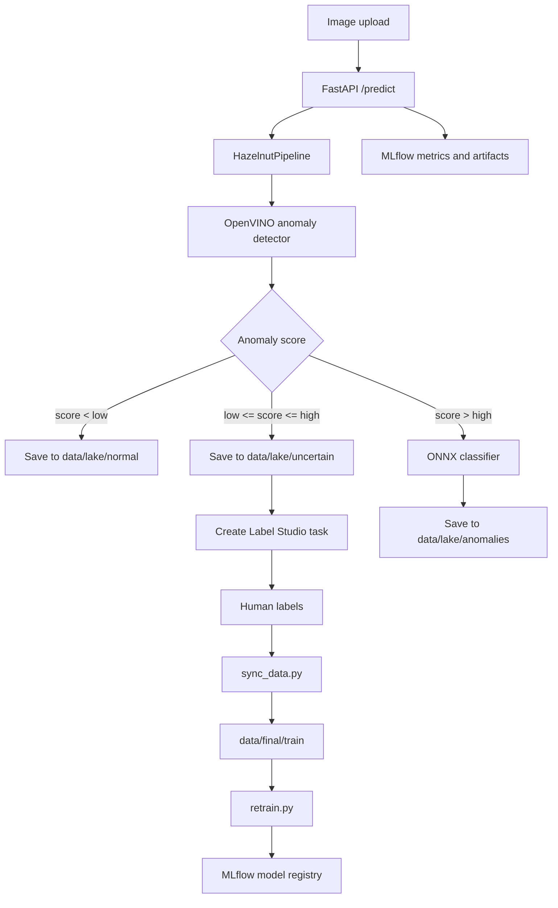

# WeirdHazelnut Architecture

## Purpose
WeirdHazelnut is a hazelnut quality-control MLOps project. It combines an
OpenVINO anomaly detector with an ONNX classifier, routes production images into
a local data lake, sends uncertain cases to Label Studio, and tracks inference,
evaluation, and retraining with MLflow.

## Runtime Flow

## Main Components
- API: `api.py` starts FastAPI through `src/weird_hazelnut/api/app.py`.
- Pipeline: `src/weird_hazelnut/pipeline/core.py` coordinates inference, routing,
  data-lake persistence, and optional Label Studio task creation.
- Inference: `src/weird_hazelnut/inference/anomaly_detector.py` wraps Anomalib
  OpenVINO inference, and `src/weird_hazelnut/inference/classifier.py` wraps ONNX
  Runtime classification.
- Integrations: `src/weird_hazelnut/integrations/mlflow_tracking.py` owns MLflow
  setup/logging, and `src/weird_hazelnut/integrations/label_studio.py` owns Label
  Studio task creation.
- Data sync: `src/weird_hazelnut/data/sync_worker.py` reads completed Label Studio
  annotations and copies images into `data/final/train/<class>`.
- Training: `src/weird_hazelnut/training/retrain.py` shells out to sibling
  training projects, then registers latest models in MLflow.

## Configuration
- Local development uses `config.yaml`.
- Docker uses `config.docker.yaml` via `CONFIG_PATH=config.docker.yaml`.
- Important keys are `models`, `pipeline.thresholds`, `pipeline.lake_dir`,
  `mlflow`, `label_studio`, and `registry`.
- Current configs contain Label Studio tokens. Treat them as local secrets and
  move them to environment variables before sharing the project.

## AI Working Guide
Inspect these first:
- `ARCHITECTURE.md`
- `README.md`
- `config.yaml` and `config.docker.yaml`
- `src/weird_hazelnut/`
- Root wrappers: `api.py`, `sync_data.py`, `retrain.py`, `evaluate_pipeline.py`
- Docker files: `Dockerfile`, `docker-compose.yml`

Avoid these unless the task is explicitly about data, model artifacts, or MLflow:
- `data/` - image datasets and data lake
- `models/` - binary model artifacts
- `mlruns/` and `mlflow.db` - MLflow runtime state
- `openvino_cache/` - generated OpenVINO cache
- `labeling/label_studio_docker/mydata/` and `label_studio_docker/mydata/` -
  Label Studio persistent state
- `__pycache__/`, `.vscode/`, `*.pyc`

## Known Technical Debt
- The project is not currently a Git repository, so changes are harder to audit.
- Root scripts used to contain application logic directly; they are now kept as
  thin compatibility entrypoints.
- `retrain.py` depends on sibling folders `../HazelnutAnomalyDetection` and
  `../HazelnutClassifier`; those paths should become config values before this
  is used in production.
- Label Studio setup is duplicated between top-level `docker-compose.yml` and
  `labeling/setup_docker.py`; prefer the top-level compose file for full-system
  runs.
- The Label Studio task path mapping assumes `data/lake` is mounted at
  `/label-studio/files/lake`.
