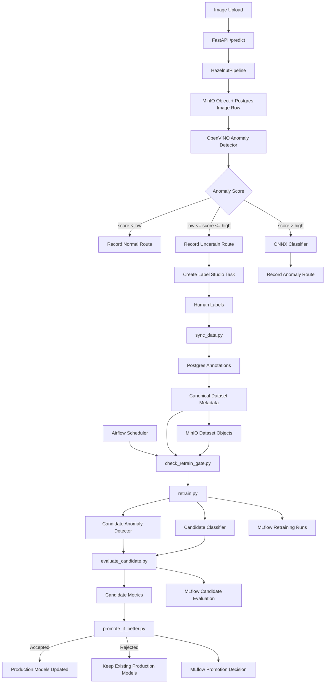

# WeirdHazelnut Architecture

## Purpose

WeirdHazelnut is a hazelnut quality-control MLOps project. It combines an
OpenVINO anomaly detector with an ONNX classifier, stores production and seed
dataset images in MinIO with metadata in Postgres, sends uncertain cases to
Label Studio through MinIO presigned URLs, tracks inference/evaluation/training
with MLflow, and performs automated human-in-the-loop retraining through Apache
Airflow.

---

## Runtime Flow



---

## Main Components

### API

- `api.py`
- `src/weird_hazelnut/api/app.py`

Starts the FastAPI inference service.

### Pipeline

- `src/weird_hazelnut/pipeline/core.py`

Coordinates:

- anomaly detection
- classification
- routing logic
- data persistence
- Label Studio task creation

### Data Layer

- `src/weird_hazelnut/data/database.py`
- `src/weird_hazelnut/data/models.py`
- `src/weird_hazelnut/data/repositories.py`
- `src/weird_hazelnut/data/storage.py`
- `src/weird_hazelnut/data/exporter.py`

Responsible for:

- Postgres metadata
- MinIO object storage
- dataset management
- dataset export

### Inference

- `src/weird_hazelnut/inference/anomaly_detector.py`
- `src/weird_hazelnut/inference/classifier.py`

Provide:

- OpenVINO anomaly detection
- ONNX Runtime defect classification

### Integrations

- `src/weird_hazelnut/integrations/mlflow_tracking.py`
- `src/weird_hazelnut/integrations/label_studio.py`

Responsible for:

- MLflow experiment tracking
- Label Studio communication

### Data Synchronization

- `sync_data.py`
- `src/weird_hazelnut/data/sync_worker.py`

Reads completed Label Studio annotations and updates the canonical dataset in
Postgres and MinIO.

### Training

- `src/weird_hazelnut/training/retrain.py`
- `src/weird_hazelnut/training/anomaly.py`
- `src/weird_hazelnut/training/classifier.py`

Retraining components that:

- read dataset metadata from Postgres
- read image bytes from MinIO
- train candidate models
- log metrics and artifacts to MLflow

Candidate models are stored in:

```text
models/anomaly_detector_retrained/
models/classifier_retrained/
```

### Orchestration

- `dags/uncertainty_retrain_dag.py`

Apache Airflow DAG responsible for automated retraining.

### Dataset Validation

- `scripts/check_retrain_gate.py`

Prevents unnecessary retraining when insufficient labeled data exists.

### Candidate Evaluation

- `scripts/evaluate_candidate.py`

Evaluates newly retrained candidate models against the canonical test split.

### Model Promotion

- `scripts/promote_if_better.py`

Compares candidate metrics against production metrics and promotes only
improved models.

---

## Automated Human-In-The-Loop Retraining

The system implements a closed-loop MLOps workflow.

Workflow:

```text
sync_labels
    ↓
check_retrain_gate
    ↓
retrain_models
    ↓
evaluate_candidate
    ↓
promote_if_better
```

### Step 1: Label Synchronization

Completed Label Studio annotations are synchronized into the canonical dataset.

Output:

```text
Postgres annotations
MinIO dataset objects
```

### Step 2: Dataset Validation Gate

Retraining only proceeds when minimum dataset requirements are satisfied.

Example:

```yaml
orchestration:
  retrain_gate:
    min_train_total: 150
    min_train_defect_total: 10
    min_val_total: 3
    min_test_total: 10
```

If the dataset fails validation, retraining is skipped.

### Step 3: Candidate Retraining

Both models are retrained:

- OpenVINO anomaly detector
- ONNX classifier

Output:

```text
models/anomaly_detector_retrained/
models/classifier_retrained/
```

Production models are not modified during this step.

### Step 4: Candidate Evaluation

Candidate models are evaluated on the canonical Postgres/MinIO test split.

MLflow run:

```text
Candidate_Model_Evaluation
```

Primary evaluation metric:

```text
eval_system_accuracy
```

### Step 5: Model Promotion

The latest candidate evaluation is compared against the latest production
baseline.

Example:

```text
baseline = 0.82
candidate = 0.85
improvement = 0.03
```

Promotion condition:

```text
candidate_metric - baseline_metric >= min_improvement
```

Example configuration:

```yaml
orchestration:
  metric_gate:
    primary_metric: eval_system_accuracy
    min_improvement: 0.01
```

### Promotion Behavior

If accepted:

```text
Candidate Models
        ↓
Production Models
```

If rejected:

```text
Keep Existing Production Models
```

No production artifacts are modified.

---

## Configuration

### Configuration Sources

- Local development: `config.yaml`
- Docker deployment: `config.docker.yaml`

### Important Configuration Groups

- `models`
- `pipeline`
- `mlflow`
- `training`
- `label_studio`
- `data_layer`
- `registry`
- `orchestration`

### Data Layer

`data_layer.enabled`

Controls:

- Postgres integration
- MinIO integration
- dataset tracking

Docker enables it by default.

---

## MLOps Lifecycle

The complete production lifecycle is:

```text
Prediction
    ↓
Uncertain Sample
    ↓
Label Studio
    ↓
Label Synchronization
    ↓
Dataset Validation
    ↓
Retraining
    ↓
Candidate Evaluation
    ↓
Promotion Decision
    ↓
Production Model Update
```

This forms the core human-in-the-loop MLOps feedback loop.

---

## AI Working Guide

Inspect these first:

- `ARCHITECTURE.md`
- `README.md`
- `config.yaml`
- `config.docker.yaml`
- `src/weird_hazelnut/`
- `dags/`
- `scripts/`

Root wrappers:

- `api.py`
- `sync_data.py`
- `retrain.py`
- `evaluate_pipeline.py`

Docker files:

- `Dockerfile`
- `docker-compose.yml`

Avoid these unless specifically required:

- `data/`
- `models/`
- `mlruns/`
- `mlflow.db`
- `openvino_cache/`
- Label Studio persistent volumes
- `__pycache__/`
- `.vscode/`

---

## Known Technical Debt

- Airflow currently promotes models by artifact replacement (file copy).
  A future version should use MLflow Model Registry stages
  (Staging → Production).

- Candidate and production evaluation currently share the same test split.
  A dedicated holdout validation dataset would improve promotion reliability.

- Anomalib training still requires a folder-shaped dataset.
  The anomaly trainer creates temporary folders during retraining and removes
  them after training completes.

- Root scripts remain compatibility wrappers while implementation lives under
  `src/weird_hazelnut/`.
