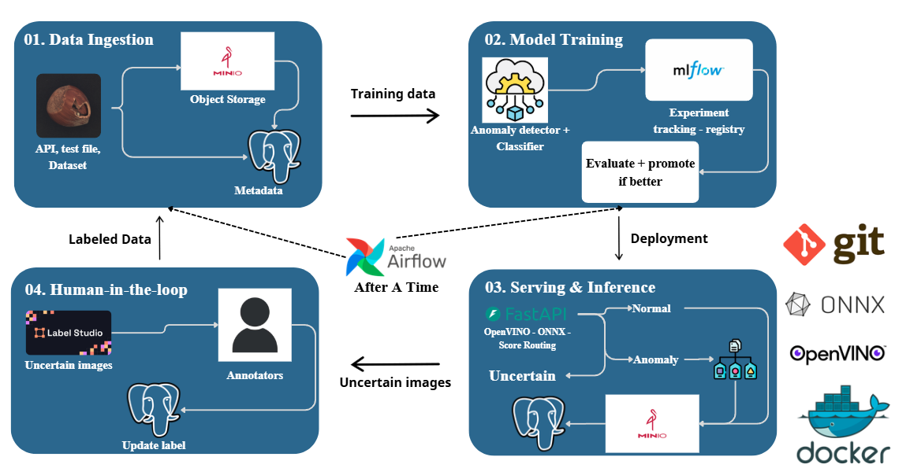
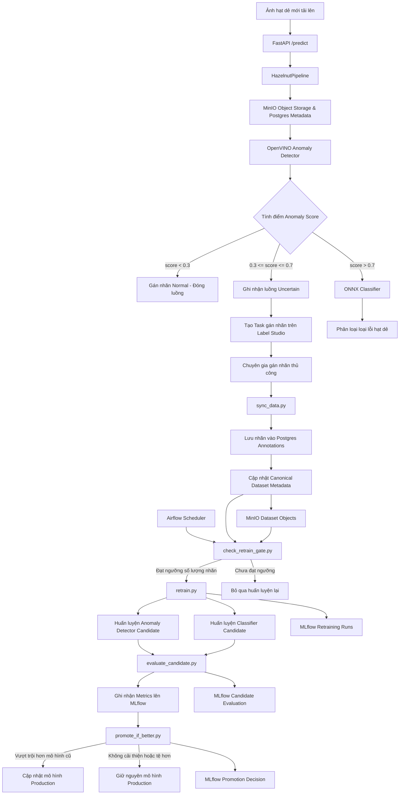

# WeirdHazelnut: An MLOps Pipeline for Hazelnut Anomaly Detection and Defect Classification

> **Môn học:** Phát triển và vận hành hệ thống máy học (MLOps)

---

## 👥 Thành viên nhóm thực hiện (Project Team Members)
| Họ và Tên | Mã số sinh viên (MSSV) |
| :--- | :--- |
| **Dương Tấn Lộc** | `23520854` |
| **Hà Xuân Hoàng** | `23520516` |
| **Nguyễn Minh Hoàng** | `23520530` |
| **Nguyễn Khánh Hoàng Hưng** | `23520566` |

---

## 🌐 Địa chỉ Truy cập Dịch vụ trực tuyến (Live Demo URLs)

Hệ thống đang được vận hành trực tiếp trên máy ảo **Azure Virtual Machine** và duy trì hoạt động 24/7 trong 2 tuần (đến cuối tháng 6/2026). Bạn có thể truy cập trải nghiệm trực tiếp các dịch vụ thông qua địa chỉ IP công khai **`20.196.237.153`**:

*   **FastAPI API (Swagger UI):** [http://20.196.237.153:8000/docs](http://20.196.237.153:8000/docs) (hoặc giao diện Web UI tại [http://20.196.237.153:8000/](http://20.196.237.153:8000/))
*   **Label Studio (Cổng gán nhãn):** [http://20.196.237.153:8080](http://20.196.237.153:8080)
    *   *Tài khoản đăng nhập mặc định:* `admin@example.com`
    *   *Mật khẩu:* `admin123456`
*   **Apache Airflow (Quản lý Pipeline):** [http://20.196.237.153:8088](http://20.196.237.153:8088)
    *   *Tài khoản:* `admin`
    *   *Mật khẩu:* `admin`
*   **MLflow UI (Theo dõi huấn luyện):** [http://20.196.237.153:5000](http://20.196.237.153:5000)
*   **MinIO Console (Bộ lưu trữ đối tượng):** [http://20.196.237.153:9001](http://20.196.237.153:9001)
    *   *Tài khoản:* `minioadmin`
    *   *Mật khẩu:* `minioadmin`

---

## 🎯 Giới thiệu Đề tài & Bài toán (Project Topic)
Hệ thống kiểm soát chất lượng sản phẩm hạt dẻ (**WeirdHazelnut**) áp dụng các nguyên lý tiên tiến của **MLOps**, đặc biệt là quy trình **Học chủ động (Active Learning)** kết hợp **Vòng lặp phản hồi từ con người (Human-in-the-Loop)**.

Mục tiêu chính là xây dựng một dây chuyền tự động hóa khép kín:
1.  Nhận diện nhanh xem hạt dẻ có bất thường không thông qua mô hình phát hiện dị dạng (Anomaly Detection) dùng **OpenVINO**.
2.  Nếu phát hiện dị dạng rõ ràng, hệ thống sẽ sử dụng mô hình phân loại chi tiết lỗi hạt dẻ (Defect Classification) dùng **ONNX** để phân tách các loại lỗi (như `crack`, `cut`, `hole`, `print`).
3.  Nếu ảnh nằm ở vùng ranh giới không chắc chắn (Uncertain), hệ thống tự động đẩy ảnh lên **Label Studio** để chuyên gia con người gán nhãn thủ công.
4.  Khi lượng dữ liệu nhãn mới đủ lớn, **Apache Airflow** tự động kích hoạt pipeline huấn luyện lại mô hình, đánh giá ứng viên (Candidate evaluation), và tự động cập nhật (Promotion) mô hình tốt nhất lên môi trường Production mà không cần can thiệp thủ công.

---

## 🏗️ Kiến trúc Hệ thống (System Architecture)

Sơ đồ khối thiết kế tổng quan của hệ thống:



Dưới đây là sơ đồ luồng hoạt động khép kín (Mermaid Diagram) chi tiết của dự án WeirdHazelnut:



### Quy tắc lưu trữ dữ liệu & Metadata:
*   **MinIO (Object Storage):** Lưu trữ các file ảnh nhị phân bất biến. Đường dẫn lưu trữ được định dạng phân cấp rõ ràng: `raw/YYYY/MM/DD/<sha256>.png` hoặc `datasets/<dataset-name>/<split>/<label>/<sha256>.png`.
*   **Postgres (Metadata):** Lưu trữ metadata của ảnh, lịch sử chạy inference, trạng thái task gán nhãn, annotations và các phiên bản tập dữ liệu (`dataset_versions`).
*   **Dữ liệu cục bộ (Local folders):** Chỉ hoạt động như phân vùng cache hoặc xuất tạm thời trong quá trình huấn luyện, không phải là nguồn dữ liệu gốc (source of truth).

### Quy trình xử lý dữ liệu (Data Processing) & Phân chia Dataset:
*   **Kiểm tra trùng lặp (Data Leakage Detection):** Trước khi huấn luyện, pipeline sử dụng hàm `detect_leakage` để so sánh các khóa `image_id` giữa tập huấn luyện (train) và tập kiểm thử (val/test), đảm bảo không xảy ra hiện tượng rò rỉ thông tin.
*   **Phân chia và Cấu trúc Tập Dữ liệu (Dataset Splitting Strategy):**
    *   **Bộ phát hiện dị thường (Anomaly Detector - PatchCore):**
        *   *Tập huấn luyện (Train):* Chỉ sử dụng **100% các ảnh bình thường (`good`)** từ tập `train` trong cơ sở dữ liệu để huấn luyện một lớp (unsupervised).
        *   *Tập kiểm thử (Test/Val):* Sử dụng toàn bộ ảnh thuộc tập `test` (gồm cả ảnh `good` và các loại lỗi `crack`, `cut`, `hole`, `print`) để đánh giá độ chính xác (AUROC, F1) và tính toán ngưỡng phân loại dị thường tối ưu.
    *   **Bộ phân loại lỗi (Classifier - MobileNetV3):**
        *   *Dữ liệu nguồn:* Kết hợp từ hai nguồn dữ liệu lỗi/dị thường (loại trừ các ảnh bình thường `good`):
            1. **Tập dữ liệu Seed:** Các ảnh lỗi (`crack`, `cut`, `hole`, `print`) sẵn có từ thư mục kiểm thử cục bộ (`data/hazelnut/test/`).
            2. **Tập dữ liệu Active Learning:** Các ảnh lỗi mới được gán nhãn thủ công thông qua Label Studio (`is_anomaly=True`), sau đó đồng bộ về database (Postgres + MinIO).
        *   *Tỷ lệ chia Train/Validation:* 
            *   Đối với **Tập dữ liệu Seed**: Chia ngẫu nhiên theo tỷ lệ **80% cho Train / 20% cho Validation (Val)**.
            *   Đối với **Tập dữ liệu Active Learning**: Chia ngẫu nhiên theo tỷ lệ **80% cho Train / 20% cho Validation (Val)**. Tuy nhiên, nếu một lớp lỗi có số mẫu active learning quá ít (dưới ngưỡng `train_priority_threshold` - mặc định là `< 10` mẫu), hệ thống tự động ưu tiên phân bổ **100%** mẫu đó vào tập Train để đảm bảo mô hình có đủ mẫu học.
*   **Tiền xử lý & Tăng cường cho bộ phân loại (Classifier Processing):**
    *   *Tiền xử lý:* Toàn bộ ảnh được tải từ MinIO thông qua `MinioImageDataset`, chuyển đổi hệ màu RGB, resize về kích thước `224x224` pixel và chuẩn hóa kênh màu theo phân phối chuẩn ImageNet (Mean và Std).
    *   *Tăng cường dữ liệu (Data Augmentation):* Hỗ trợ 3 cấp độ thông qua cấu hình `augment_level`:
        *   **Light:** Lật ngang/dọc ngẫu nhiên (`RandomHorizontalFlip`, `RandomVerticalFlip`) và chỉnh độ sáng/tương phản (`ColorJitter`).
        *   **Medium (Mặc định):** Bổ sung thêm xoay ngẫu nhiên 30 độ (`RandomRotation`) và biến đổi affine (`RandomAffine`).
        *   **Heavy:** Bổ sung thêm làm mờ Gaussian (`GaussianBlur`) và xóa vùng ngẫu nhiên (`RandomErasing` với xác suất 20%).
*   **Xử lý cho bộ phát hiện dị thường (Anomaly Detector Processing):**
    *   *Cầu nối trung gian (Staging):* Sử dụng lớp `AnomalibFolderStaging` để tạo thư mục tạm, tự động tải ảnh từ MinIO và lưu thành file cục bộ theo cấu trúc thư mục phân cấp phục vụ cho thư viện Anomalib (`train/good` và `test/<label>`).
    *   *Tiền xử lý:* Resize ảnh về kích thước `256x256` pixel theo cấu hình huấn luyện của thuật toán PatchCore.

---

## ⭐ Điểm bổ sung nổi bật cho Học phần Thực hành (MLOps Practical Enhancements)

Để đáp ứng đầy đủ các tiêu chí chấm điểm khắt khe về tính thực tiễn (Practical & Hands-on), đồ án đã phát triển thêm 2 cấu phần cốt lõi:

### 1. Triển khai tự động lên đám mây (Cloud Deployment)
*   **Môi trường:** Triển khai thực tế trên máy ảo **Azure Virtual Machine** (Ubuntu 22.04 LTS).
*   **Script tự động hóa:** Phát triển script [deploy_azure.py](scripts/deploy_azure.py) giúp đóng gói toàn bộ mã nguồn cục bộ, kết nối SSH, tự động cài đặt Docker, Docker Compose V2, Unzip trên máy ảo, truyền mã nguồn qua SCP, tự thiết lập thư mục chứa model, và chạy container hóa toàn bộ stack bằng lệnh `docker compose up -d --build`.
*   **Quản lý Cổng (Ports) công khai trên Azure:**
    *   **FastAPI API & Web UI:** Port `8000`
    *   **Label Studio:** Port `8080`
    *   **MLflow UI:** Port `5000`
    *   **Airflow Webserver:** Port `8088`
    *   **MinIO Console:** Port `9001`

### 2. Hệ thống lưu trữ log đám mây (Cloud Logging)
*   **Grafana Loki Integration:** Tích hợp dịch vụ đám mây **Grafana Cloud Loki** nhằm quản lý log tập trung cho dự án.
*   **Async Loki Logging Handler:** Triển khai handler [loki.py](src/weird_hazelnut/integrations/loki.py) kế thừa từ thư viện `logging.Handler` của Python. Log sẽ được đưa vào một hàng đợi (`queue.Queue`) và được gửi bất tuần tự bằng tiến trình chạy ngầm (`threading.Thread`) dưới dạng batches lên HTTP API của Loki. Thiết kế này giúp log ghi nhận tức thời mà không gây ảnh hưởng hay tăng độ trễ (latency) của FastAPI khi xử lý ảnh.
*   **Bảo mật cấu hình:** Nạp động cấu hình Loki từ file `.env` cục bộ trên VM, đảm bảo không bị rò rỉ token API lên repo Github công khai.

---

## 📂 Cấu trúc Thư mục Dự án

```text
├── .dockerignore                 # Chỉ định các file loại trừ khi build Docker image
├── .gitignore                    # Chỉ định các file loại trừ khi push lên Git
├── .env.example                  # File cấu hình biến môi trường mẫu
├── docker-compose.yml            # Định nghĩa toàn bộ stack container dịch vụ
├── Dockerfile                    # Dockerfile dùng chung cho API app và MLflow
├── config.yaml                   # Cấu hình hệ thống khi chạy local
├── config.docker.yaml            # Cấu hình hệ thống khi chạy trong Docker
├── requirements.txt              # Danh sách thư viện Python phụ thuộc
├── api.py                        # Điểm khởi chạy FastAPI app (gọi uvicorn)
├── sync_data.py                  # Script đồng bộ nhãn từ Label Studio về Postgres
├── retrain.py                    # Script huấn luyện lại mô hình
├── evaluate_pipeline.py          # Script đánh giá hiệu năng pipeline hiện tại
├── dags/
│   └── uncertainty_retrain_dag.py # DAG Airflow định nghĩa pipeline tự động
├── labeling/
│   └── init_project.py           # Khởi tạo dự án và kết nối lưu trữ trên Label Studio
├── scripts/
│   ├── deploy_azure.py           # Script tự động deploy hệ thống lên Azure VM
│   ├── migrate_dataset_to_datalake.py # Seed dữ liệu ban đầu từ local vào MinIO/Postgres
│   ├── check_retrain_gate.py     # Cổng kiểm tra điều kiện kích hoạt huấn luyện lại
│   ├── evaluate_candidate.py     # Đánh giá mô hình ứng viên mới huấn luyện
│   └── promote_if_better.py      # Đánh giá và cập nhật mô hình lên Production
├── src/
│   └── weird_hazelnut/
│       ├── api/                  # Ứng dụng FastAPI chính
│       ├── config/               # Cấu hình dự án & nạp biến môi trường
│       ├── data/                 # Data Layer (Database, Repositories, Storage)
│       ├── inference/            # Bộ suy luận mô hình (OpenVINO & ONNX)
│       ├── integrations/         # Tích hợp ngoài (Label Studio, MLflow, Loki)
│       ├── orchestration/        # Các task định nghĩa cho Airflow
│       ├── pipeline/             # Pipeline xử lý ảnh cốt lõi
│       └── training/             # Huấn luyện mô hình (Anomaly & Classifier)
└── tests/                        # Các test case kiểm thử dự án
```

---

## 🛠️ Hướng dẫn Từng bước Tái lập Dự án (Step-by-Step Reproduction Guide)

Hãy tuân thủ đúng trình tự 8 bước dưới đây để thiết lập, cấu hình và khởi chạy toàn bộ hệ thống từ đầu:

### Bước 1: Khởi tạo Máy ảo (VM) trên Azure
1. Khởi tạo một máy ảo **Azure Virtual Machine** chạy hệ điều hành **Ubuntu 22.04 LTS**.
2. Thiết lập Network Security Group (NSG) trên Azure Portal để mở công khai các cổng (ports) sau để các dịch vụ kết nối bên ngoài:
   *   Port `8000`: FastAPI API & Web UI
   *   Port `8080`: Label Studio
   *   Port `5000`: MLflow UI
   *   Port `8088`: Airflow Webserver
   *   Port `9001`: MinIO Console
3. Tải file khóa SSH riêng tư (ví dụ: `ubuntu-vm_key.pem`) về máy local của bạn.

### Bước 2: Đăng ký và Cấu hình Grafana Cloud Loki
1. Truy cập [Grafana Cloud](https://grafana.com/products/cloud/) đăng ký một tài khoản miễn phí.
2. Tại trang quản trị Grafana Cloud Portal, tìm đến mục **Loki** và nhấn vào **Details**.
3. Ghi lại các thông số kết nối:
   *   **URL:** Đường dẫn API endpoint của Loki (ví dụ: `https://logs-prod-020.grafana.net/loki/api/v1/push`).
   *   **User ID:** Mã định danh người dùng (dạng số).
   *   **Password/Token:** Tạo một API Token mới có quyền `metrics:write` (hoặc ghi log) để nạp vào biến môi trường.

### Bước 3: Tải mã nguồn dự án (Clone Repository)
Tại terminal máy tính cá nhân (máy Local), thực hiện tải mã nguồn và di chuyển vào thư mục dự án:
   ```bash
   git clone https://github.com/locluclak/Weird_Hazelnut_FullMLops.git
   cd Weird_Hazelnut_FullMLops
   ```

### Bước 4: Thiết lập Môi trường Cục bộ & Cấu hình Biến môi trường
1. **Khởi tạo thư mục chứa weights mô hình:**
   Do các thư mục chứa mô hình đã được thêm vào `.gitignore` để tránh đẩy file nhị phân nặng lên GitHub, bạn cần khởi tạo cấu trúc thư mục này thủ công trên máy local trước khi deploy:
   ```bash
   mkdir -p models/anomaly_detector models/classifier
   ```
   *Lưu ý:* Hãy đặt các tệp pre-trained weights mẫu tương ứng vào hai thư mục trên:
   *   Thư mục `models/anomaly_detector/` cần chứa: `model.xml` và `model.bin` (định dạng OpenVINO).
   *   Thư mục `models/classifier/` cần chứa: `model.onnx`, `model.onnx.data` (nếu có) và `meta.json` (định dạng ONNX).
2. **Cấu hình tệp môi trường `.env`:**
   Tạo tệp `.env` từ tệp ví dụ `.env.example`:
   ```bash
   cp .env.example .env
   ```
   Mở tệp `.env` vừa tạo và điền các thông số:
   *   Đặt `LABEL_STUDIO_API_KEY` tạm thời bằng một giá trị giả lập (chúng ta sẽ cập nhật giá trị thật ở Bước 6).
   *   Cấu hình Grafana Loki bằng các thông số đã lấy ở Bước 2:
       ```env
       LOKI_ENABLED=true
       LOKI_URL=https://logs-prod-020.grafana.net/...
       LOKI_USER=<Mã_User_ID>
       LOKI_PASSWORD=<API_Token_Loki>
       ```
3. **Tạo môi trường ảo và cài đặt thư viện:**
   Sử dụng Conda để tạo môi trường ảo Python 3.10:
   ```bash
   conda create -n hazelnut python=3.10 -y
   conda activate hazelnut
   pip install -r requirements.txt
   ```
4. **Chạy Unit Tests kiểm tra cục bộ:**
   Kiểm tra xem các module suy luận, pipeline và tích hợp có hoạt động ổn định trên máy local hay không bằng unittest:
   ```bash
   python -m unittest discover -s tests -p "test_*.py"
   ```

### Bước 5: Triển khai Hệ thống lên Azure VM bằng Script tự động
1. Sao chép tệp khóa SSH `.pem` (được tải về từ Bước 1) vào thư mục gốc của dự án cục bộ và đặt tên đúng là `ubuntu-vm_key.pem` (hoặc cập nhật biến `PEM_KEY` trong script `scripts/deploy_azure.py`).
2. Mở file [deploy_azure.py](scripts/deploy_azure.py) và thay đổi giá trị `VM_IP` thành địa chỉ IP công khai của máy ảo Azure VM của bạn (ví dụ: `20.196.237.153`).
3. Chạy script deploy từ terminal máy local:
   ```bash
   python scripts/deploy_azure.py
   ```
   *Cơ chế tự động của script:*
   *   Nén toàn bộ mã nguồn ngoại trừ các thư mục log, cache và git thành tệp `deployment.zip`.
   *   Kết nối SSH tới Azure VM, cài đặt tự động `docker.io`, `docker-compose-v2` và `unzip`.
   *   Tải tệp `deployment.zip` và `.env` lên VM thông qua SCP.
   *   Giải nén mã nguồn vào thư mục `/home/azureuser/weird-hazelnut` trên VM.
   *   Khởi tạo cấu trúc thư mục chứa mô hình production trên VM và sao chép weights mẫu vào đúng vị trí.
   *   Khởi chạy toàn bộ stack dịch vụ container bằng lệnh `docker compose up -d --build`.

### Bước 6: Khởi tạo Dự án trên Label Studio & Cấu hình API Key thật
1. Kết nối SSH vào Azure VM:
   ```bash
   ssh -i ubuntu-vm_key.pem azureuser@20.196.237.153
   ```
2. Truy cập vào thư mục dự án trên VM và chạy script khởi tạo dự án Label Studio:
   ```bash
   cd /home/azureuser/weird-hazelnut
   docker compose exec app python labeling/init_project.py
   ```
   *Lưu ý:* Script sẽ tự động tạo một dự án gán nhãn mới có tên **WeirdHazelnut** trên Label Studio và kết nối nó với vùng lưu trữ dữ liệu cục bộ (Local Storage).
3. Đăng nhập vào giao diện Label Studio Web UI tại địa chỉ `http://20.196.237.153:8080` với tài khoản mặc định `admin@example.com` / `admin123456`.
4. Đi tới góc trên bên phải -> chọn **Account & Settings** -> nhấn hiển thị và copy chuỗi **Access Token** (API Key).
5. Mở file `.env` trên VM:
   ```bash
   nano .env
   ```
   Thay thế giá trị `LABEL_STUDIO_API_KEY` bằng token thật vừa copy, sau đó lưu lại.
6. Cập nhật lại cấu hình cho container app chạy trên VM bằng cách restart:
   ```bash
   docker compose restart app
   ```

### Bước 7: Nạp Dữ liệu ban đầu (Data Seeding) vào Data Lake
1. Chạy script migration để nạp tập dữ liệu hạt dẻ mẫu ban đầu từ thư mục `data/hazelnut` vào hệ thống lưu trữ MinIO và cơ sở dữ liệu Postgres:
   ```bash
   docker compose exec app python scripts/migrate_dataset_to_datalake.py --dataset-root data/hazelnut --dataset-name initial_hazelnut
   ```
   *Ý nghĩa:* Tải dữ liệu ảnh lên MinIO bucket `lake`, tạo các bản ghi metadata trong DB Postgres, và phân tách tập Train/Test/Val ban đầu.

### Bước 8: Kiểm tra hoạt động ghi log trên Grafana Loki
1. Truy cập vào trang quản trị Grafana Cloud dashboard của bạn.
2. Mở mục **Explore**, chọn nguồn dữ liệu là **Loki**.
3. Thực thi câu truy vấn log: `{app="weird-hazelnut"}`.
4. Đảm bảo toàn bộ log ghi nhận từ container FastAPI `app` đã hiển thị đầy đủ và thời gian thực trên giao diện đồ thị Grafana Cloud.

---

## 🔄 Quy trình Hoạt động & Sử dụng Hệ thống (Usage Guide)

Dưới đây là chi tiết luồng xử lý và cách thức vận hành hệ thống WeirdHazelnut sau khi triển khai thành công:

### 1. Luồng xử lý và Phân phối API (Inference & Routing Logic)
Để kiểm tra tính năng suy luận thời gian thực, bạn gửi một tệp ảnh hạt dẻ bất kỳ đến API FastAPI thông qua REST request:
```bash
curl -X POST http://20.196.237.153:8000/predict -F "file=@data/hazelnut/test/good/000.png"
```
**Cơ chế Phân Luồng của Pipeline (Routing Logic):**
*   **Bước A:** FastAPI tiếp nhận yêu cầu và lưu trữ ảnh nhị phân bất biến vào MinIO Object Storage (bucket: `lake`), đồng thời tạo bản ghi metadata tương ứng trong Postgres DB với trạng thái ban đầu.
*   **Bước B:** Chạy mô hình phát hiện dị dạng **OpenVINO Anomaly Detector** trên ảnh đầu vào để tính toán điểm số bất thường (`anomaly_score`).
*   **Bước C (Phân luồng 3 nhánh):**
    1.  **Nhánh Normal (`anomaly_score < 0.3`):** Hạt dẻ được phân loại là bình thường. Hệ thống ghi nhận nhãn `Normal` vào Postgres và kết thúc luồng xử lý.
    2.  **Nhánh Uncertain (`0.3 <= anomaly_score <= 0.7`):** Điểm số nằm ở vùng ranh giới mập mờ, hệ thống không chắc chắn. Ảnh sẽ được đánh dấu trạng thái là `uncertain` trong Postgres và hệ thống tự động gọi API của **Label Studio** để tạo một Task gán nhãn mới, chờ chuyên gia con người kiểm định.
    3.  **Nhánh Anomalies (`anomaly_score > 0.7`):** Xác định hạt dẻ bị lỗi rõ ràng. Hệ thống kích hoạt tiếp mô hình phân loại **ONNX Defect Classifier** để phân tách chi tiết lỗi (`crack`, `cut`, `hole`, `print`). Kết quả phân loại chi tiết cùng nhãn lỗi được cập nhật vào Postgres.

### 2. Vòng lặp phản hồi từ con người (Human Labeling Loop)
1. Người kiểm định truy cập Label Studio tại `http://20.196.237.153:8080`, chọn dự án WeirdHazelnut.
2. Tiến hành gán nhãn thủ công cho các bức ảnh thuộc diện `uncertain` bằng cách chọn nhãn đúng (`Normal` hoặc các loại lỗi `crack`, `cut`, `hole`, `print`) và nhấn **Submit**.
3. Đồng bộ hóa nhãn đã gán về cơ sở dữ liệu Postgres bằng cách thực thi lệnh sau trên Azure VM:
   ```bash
   docker compose exec app python sync_data.py
   ```
   *Cơ chế hoạt động:* Script sẽ quét các tác vụ đã gán nhãn thành công từ Label Studio API, tải nhãn đúng về cập nhật cột `label` và chuyển trạng thái từ `uncertain` sang nhãn chính xác trong Postgres, đồng thời đưa ảnh vào phiên bản dataset canonical mới.

### 3. Tự động Huấn luyện lại và Cập nhật Mô hình (Auto Retraining & Promotion)
Hệ thống sử dụng **Apache Airflow** để định kỳ kích hoạt hoặc người dùng có thể truy cập Airflow Webserver tại `http://20.196.237.153:8088` để trigger thủ công DAG `uncertainty_retrain_dag`.
Bạn cũng có thể chạy lệnh trigger trực tiếp từ terminal của VM:
```bash
docker compose exec airflow-scheduler airflow dags trigger uncertainty_retrain_dag
```

**Chi tiết luồng hoạt động của DAG:**
1.  **Task `sync_labels`:** Gọi script `sync_data.py` để cập nhật các nhãn mới gán từ Label Studio về Postgres DB.
2.  **Task `check_retrain_gate`:** Thực thi script `scripts/check_retrain_gate.py` để đếm số lượng bản ghi nhãn mới được con người gán thêm. Nếu số nhãn mới nhỏ hơn cấu hình tối thiểu (mặc định là `10`), DAG sẽ dừng lại và bỏ qua (skip) các task sau để tránh lãng phí tài nguyên.
3.  **Task `retrain_models`:** Thực thi script `retrain.py`. Hệ thống tự động trích xuất phiên bản dataset mới nhất từ MinIO/Postgres, thực hiện huấn luyện lại cả hai mô hình Anomaly Detector Candidate và Classifier Candidate với dữ liệu bổ sung.
4.  **Task `evaluate_candidate`:** Thực thi script `scripts/evaluate_candidate.py`. Đánh giá hiệu suất của mô hình ứng viên mới huấn luyện trên tập dữ liệu kiểm thử (Test Split) cố định. Toàn bộ các thông số huấn luyện, tham số siêu tham số và chỉ số đánh giá (Accuracy, F1, Loss) được ghi nhận trực tiếp lên **MLflow UI** (`http://20.196.237.153:5000`).
5.  **Task `promote_if_better`:** Thực thi script `scripts/promote_if_better.py`. So sánh chỉ số Accuracy (`eval_system_accuracy`) của mô hình Candidate với mô hình Production đang chạy. Nếu mô hình Candidate tốt hơn mô hình cũ ít nhất 1% (ngưỡng tối thiểu), weights của mô hình Candidate sẽ được chép đè vào thư mục production `/app/models/`.
6.  **Cập nhật Mô hình (Hot-load & Container Reload):**
    Để FastAPI tải và áp dụng mô hình mới vừa được cập nhật vào thư mục `/app/models/`, hãy chạy lệnh restart container app trên VM:
    ```bash
    docker compose restart app
    ```
