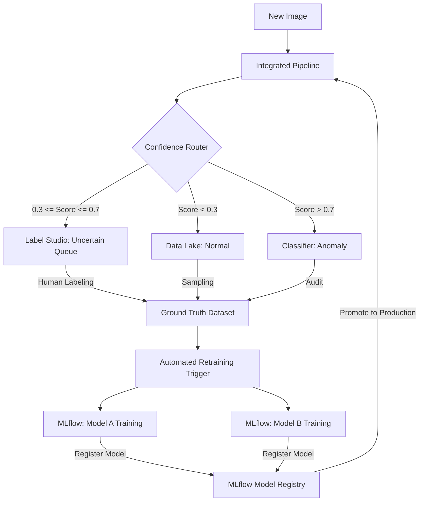

# MLOps Pipeline Expansion: Human-in-the-Loop & Automated Retraining

This document outlines the strategic plan for evolving the **WeirdHazelnut** project into a full-lifecycle MLOps system. The goal is to move beyond static inference into a continuous improvement loop using active learning and automated retraining.

## 1. System Architecture Overview

The expanded system follows a "Data Flywheel" pattern where production data continuously improves the models.

## 2. Human-in-the-Loop (Label Studio Integration)

Images flagged as **Uncertain** by the Anomaly Detector are redirected for expert review to ensure high-quality ground truth.

### Workflow:
- **Automated Task Creation**: The `api.py` service (or a background worker) will use the Label Studio SDK to upload "uncertain" images as new labeling tasks.
- **Labeling Interface**: Annotators will be presented with:
    1. **Primary Choice**: `Normal` or `Anomaly`.
    2. **Conditional Choice**: If `Anomaly`, select sub-class (`crack`, `cut`, `hole`, `print`).
- **Data Synchronization**: A webhook from Label Studio will notify the system when a task is completed, moving the image from `data/lake/uncertain` to the definitive `data/final/` training set.

## 3. Automated Training Pipeline

Retraining is triggered to adapt models to new data distributions or to fix known "hard cases" identified during labeling.

### Trigger Logic:
- **Volume-based**: Every 100 new high-quality labels added to the training set.
- **Time-based**: Weekly scheduled training runs if new data is available.

### Model-Specific Training:
1.  **Model A (Anomaly Detector)**:
    - Uses `Anomalib` (PatchCore/Padim).
    - Re-trained primarily on the expanded `good` dataset (including images newly confirmed as `normal`).
    - **Validation**: Evaluated against the full test set to ensure no regression in AUC/F1.
2.  **Model B (Classifier)**:
    - Uses `PyTorch` (MobileNetV3-Large).
    - Re-trained on the multi-class dataset (`good`, `crack`, `cut`, etc.).
    - Implements weighted sampling to handle the class imbalance inherent in manufacturing data.

## 4. MLflow Lifecycle Management

MLflow acts as the "Brain" of the MLOps system, handling tracking, versioning, and visualization.

### Advanced Tracking Features:
- **Experiment Comparison**: Compare the ROC/PR curves of `Model_A_v2` vs `Model_A_v1` directly in the UI.
- **Model Registry**:
    - **Stage: Staging**: For models that passed CI/CD checks but haven't been tested on live traffic.
    - **Stage: Production**: The version currently served by the FastAPI pipeline.
- **Visual Artifacts**:
    - Heatmap/Original collages for all failed validation images.
    - Feature distribution plots to detect data drift.

## 5. Implementation Roadmap (Next Tasks)

| Phase | Task | Description |
|:---:|:---|:---|
| **1** | **Label Studio SDK Setup** | Integrate Label Studio API in a background worker to push `uncertain/` images. |
| **2** | **Data Sync Worker** | Script to pull labeled data from Label Studio and update `data/final/` structure. |
| **3** | **Retraining Orchestrator** | Develop a master script that executes `train.py` for both AD and Classifier using updated data. |
| **4** | **Auto-Versioning** | Implement `mlflow.register_model` logic to automate the "Candidate -> Registered" flow. |
| **5** | **Live Promotion** | Update `config.yaml` to dynamically point to the latest `Production` model in the registry. |

## 6. Development Guidelines
- **Reproducibility**: All training runs MUST use DVC-versioned datasets.
- **Safety**: New models MUST be validated against a "Golden Test Set" before being promoted to `Production`.
- **Visibility**: Every transition (data labeled, training started, model promoted) MUST be logged as a "Note" or "Tag" in MLflow.
